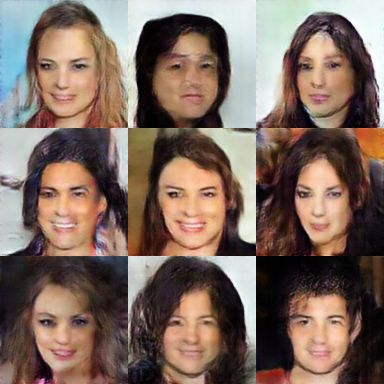

<h1 align='center' style="text-align:center; font-weight:bold; font-size:2.0em;letter-spacing:2.0px;">
                A Closer Look at Fourier Spectrum Discrepancies for</br>CNN-generated Images Detection</h1>
<p align='center' style="text-align:center;font-size:1.25em;">
    <a href="https://keshik6.github.io/" target="_blank" style="text-decoration: none;">Keshigeyan&nbsp;Chandrasegaran</a>&nbsp;/&nbsp;
    <a href="https://scholar.google.com/citations?hl=en&user=9SE3GYMAAAAJ" target="_blank" style="text-decoration: none;">Ngoc&#8209;Trung&nbsp;Tran</a>&nbsp;/&nbsp;
    <a href="https://sites.google.com/site/mancheung0407/" target="_blank" style="text-decoration: none;">Ngai&#8209;Man&nbsp;Cheung</a></br>
Singapore University of Technology and Design (SUTD)<br/>
<em>CVPR&nbsp;2021&nbsp;(Oral)</br></em>
<a href="https://keshik6.github.io/Fourier-Discrepancies-CNN-Detection/" title="Project" target="_blank" rel="nofollow" style="text-decoration: none;">Project</a> |
<a href="https://arxiv.org/abs/2103.17195" title="CVPR Paper" target="_blank" rel="nofollow" style="text-decoration: none;">CVPR Paper</a> |
<a href="https://drive.google.com/drive/folders/123RpZhytXBrJQyHg_0f46W-Qv3t5Hwsl?usp=sharing" title="GAN Models" target="_blank" rel="nofollow" style="text-decoration: none;">GAN Models</a>
</p>


## Abstract

CNN-based generative modelling has evolved to produce synthetic images indistinguishable from real images in the RGB pixel space. Recent works have observed that CNN-generated images share a systematic shortcoming in replicating high frequency Fourier spectrum decay attributes. Furthermore, these works have successfully exploited this systematic shortcoming to detect CNN-generated images reporting up to 99% accuracy across multiple state-of-the-art GAN models.

</br>

In this work, we investigate the validity of assertions claiming that CNN-generated images are unable to achieve high frequency spectral decay consistency. We meticulously construct a counterexample space of high frequency spectral decay consistent CNN-generated images emerging from our handcrafted experiments using DCGAN, LSGAN, WGAN-GP and StarGAN, where we empirically show that this frequency discrepancy can be avoided by a minor architecture change in the last upsampling operation. We subsequently use images from this counterexample space to successfully bypass the recently proposed forensics detector which leverages on high frequency Fourier spectrum decay attributes for CNN-generated image detection.

</br>

Through this study, we show that high frequency Fourier spectrum decay discrepancies are not inherent characteristics for existing CNN-based generative models--contrary to the belief of some existing work--, and such features are not robust to perform synthetic image detection. Our results prompt re-thinking of using high frequency Fourier spectrum decay attributes for CNN-generated image detection.


## About the code

**GAN  :** This is written in Pytorch. This codebase leverages on Pytorch Lightning [[1]](#1) module to efficiently scale our GAN training to multi-GPU infrastructure. We also use Webdataset [[2]](#2) (Pytorch Iterable Dataset implementation) that allows efficient access to datasets stored in POSIX tar archives using only sequential disk access. We also provide the Docker file to run our code. The codebase is clearly documented with bash file execution points exposing all required arguments and hyper-parameters.

:white_check_mark: Pytorch

:white_check_mark: Pytorch Lightning [[1]](#1)

:white_check_mark: ​WebDataset [[2]](#2)

:white_check_mark: ​Multi-GPU training

:white_check_mark: ​DockerFile


**Fourier Synthetic Image classifier :** The code uses high frequency features extracted using the official matlab implementation by Dzanic et al. [[3]](#3). The matlab code can be found [[4]](#4). The code is clearly documented.


## Running the code

**GAN :** Clear steps on how to run and reproduce our results for DCGAN, LSGAN, WGAN-GP and StarGAN experiments can be found at [src/gans/README.md](src/gans/README.md). 

**Fourier Synthetic Image classifier :** Clear steps on how to run and reproduce our results for KNN, SVM and MLP classfier experiments using high frequency features extracted from Dzanic et al work can be found at [src/classifiers/README.md](src/classifiers/README.md)


## GAN Samples

|   GAN   |                Baseline                 |                N.1.5                 |                B.1.5                 |                Z.1.5                 |
| :-----: | :-------------------------------------: | :----------------------------------: | :----------------------------------: | :----------------------------------: |
|  DCGAN  |    |    |    |    |
|  LSGAN  |  |  |  |  |
| WGAN-GP |   |   |   |   |


## FID Scores for CelebA experiments

| Setup Code | DCGAN | LSGAN | WGAN-GP |
| ---------- | ----- | ----- | ------- |
| Baseline   | 88.60 | 73.26 | 60.60   |
| N.1.5      | 87.52 | 70.69 | 48.69   |
| Z.1.5      | 69.14 | 60.29 | 47.73   |
| B.1.5      | 84.65 | 78.66 | 52.18   |
| N.1.7      | 90.80 | 73.09 | 60.11   |
| Z.1.7      | 71.45 | 59.55 | 43.10   |
| B.1.7      | 79.92 | 76.33 | 55.28   |
| N.1.3      | 93.54 | 74.07 | 58.35   |
| Z.1.3      | 65.46 | 61.45 | 56.91   |
| B.1.3      | 76.04 | 81.97 | 58.55   |
| N.3.5      | 73.63 | 78.31 | 55.47   |
| Z.3.5      | 68.41 | 66.27 | 57.59   |
| B.3.5      | 80.89 | 72.29 | 54.84   |


## Pretrained Models

All pretrained DCGAN, LSGAN and WGAN-GP CelebA models are available [here](https://drive.google.com/drive/folders/123RpZhytXBrJQyHg_0f46W-Qv3t5Hwsl?usp=sharing)


## Citation

```markdown
@InProceedings{Chandrasegaran2021,
    author        = {Keshigeyan Chandrasegaran and Ngoc-Trung Tran and Ngai-Man Cheung},
    booktitle     = {Proceedings of the IEEE/CVF Conference on Computer Vision and Pattern Recognition (CVPR)},
    title         = {A Closer Look at Fourier Spectrum Discrepancies for CNN-generated Images Detection},
    year          = {2021}
}
```


## Acknowledgements

We gratefully acknowledge the following works:

- DCGAN / LSGAN/ WGAN-GP : https://github.com/LynnHo/DCGAN-LSGAN-WGAN-GP-DRAGAN-Pytorch
- Pytorch FID : https://github.com/mseitzer/pytorch-fid
- Pytorch Lightning : https://github.com/PyTorchLightning/pytorch-lightning
- WebDataset : https://github.com/tmbdev/webdataset
- StarGAN : https://github.com/yunjey/stargan
- Spectral Regularization : https://github.com/cc-hpc-itwm/UpConv
- High frequency spectral features extraction code : https://github.com/tarikdzanic/FourierSpectrumDiscrepancies


## References

<a id="1">[1]</a> https://www.pytorchlightning.ai/

<a id="2">[2]</a> https://github.com/tmbdev/webdataset

<a id="3">[3]</a> Fourier Spectrum Discrepancies in Deep Network Generated Images, Tarik Dzanic, Karan Shah, and Freddie D. Witherden, In NeurIPS, 2020

<a id="4">[4]</a> https://github.com/tarikdzanic/FourierSpectrumDiscrepancies)

